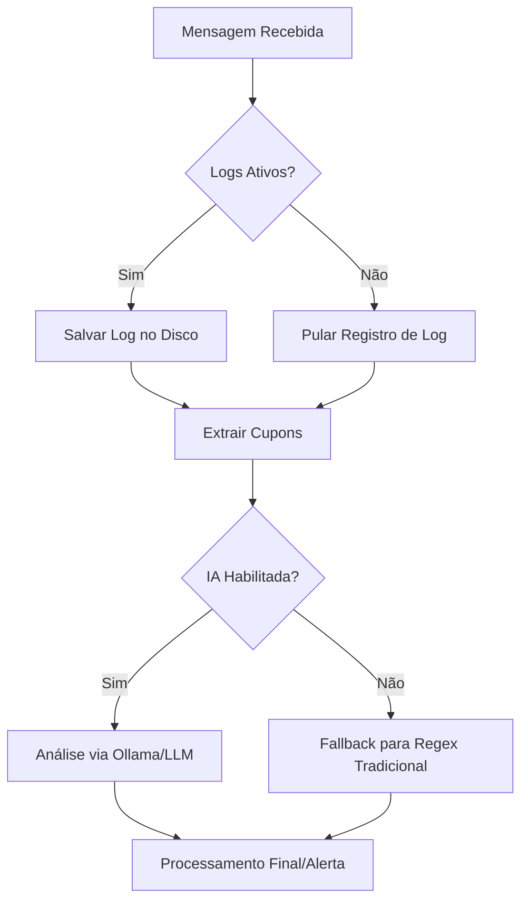

# AI Knowledge Base - G_aBot

## Fluxo de Processamento de Mensagens e Cupons



## Arquivos Modificados/Criados

| Arquivo | Ação | Descrição |
| --- | --- | --- |
| [src/config.js](file:///home/gabs/projects/G_aBot/src/config.js) | Modificado | Adicionada a flag `logsEnabled` nas configurações do bot. Convertida função tradicional `buildOllamaInstances` em arrow function. |
| [src/services/messageLogger.js](file:///home/gabs/projects/G_aBot/src/services/messageLogger.js) | Modificado | Adicionado atalho de retorno antecipado se `BOT_CONFIG.logsEnabled` for falso. Convertidas todas as funções para arrow functions com JSDocs estruturados. |
| [src/services/aiCouponParser.js](file:///home/gabs/projects/G_aBot/src/services/aiCouponParser.js) | Modificado | Definido `enabled` permanentemente como `false` em `AI_CONFIG`. Convertidas funções para arrow functions com JSDocs estruturados. |
| [.env.example](file:///home/gabs/projects/G_aBot/.env.example) | Modificado | Adicionada documentação para a nova variável de ambiente `BOT_LOGS_ENABLED`. |
| [test/loggingAndAiToggle.test.js](file:///home/gabs/projects/G_aBot/test/loggingAndAiToggle.test.js) | Criado | Novos testes unitários validando a desativação da IA por padrão, a flag de configuração de logs, e o comportamento do message logger de não escrever arquivos caso os logs estejam desativados. |

## Lógica de Decisão

```text
REGRAS_DE_NEGOCIO_LOGS_E_IA:
- SE BOT_LOGS_ENABLED for "false" no .env, ENTÃO logsEnabled será definido como false em BOT_CONFIG.
- NO LOGGER (messageLogger.js), SE logsEnabled for false, ENTÃO as funções de gravação retornam imediatamente sem tentar acessar o disco.
- NA IA (aiCouponParser.js), a propriedade enabled é mantida como false para impedir qualquer conexão ao Ollama ou parsing com IA, forçando fallback nativo via Regex em couponExtractor.js.
```

## Comportamento da Feature

- **Coleta de Logs de Mensagem**:
  - Pode ser ativada ou desativada via variável de ambiente `BOT_LOGS_ENABLED` (padrão `true` se omitida).
  - Quando desativada (`BOT_LOGS_ENABLED=false`), as chamadas de logs em grupos ou usuários privados retornam de imediato, evitando criação de arquivos e consumo desnecessário de I/O em disco.
- **Desativação do Processamento de Cupons via IA**:
  - A propriedade `enabled` do parser de IA está travada em `false`.
  - Isso remove totalmente o tempo gasto inicializando o Ollama na inicialização e o delay nas mensagens de cupons (fallback regex é instantâneo).

## Checklist de Aceite

- [x] Variável de ambiente `BOT_LOGS_ENABLED` adicionada ao `src/config.js` e documentada no `.env.example`.
- [x] `logGroupMessage` e `logUserMessage` retornam sem escrever no disco se os logs estiverem desativados.
- [x] O parser de IA (`aiCouponParser.js`) foi desativado por padrão definindo `enabled: false`.
- [x] Todas as funções modificadas ou criadas seguem a especificação de arrow functions (`const fn = () => {}`) e utilizam JSDoc nos métodos públicos.
- [x] Testes unitários foram criados especificamente para cobrir essas duas regras.
- [x] Todos os 41 testes da aplicação passam com sucesso.
