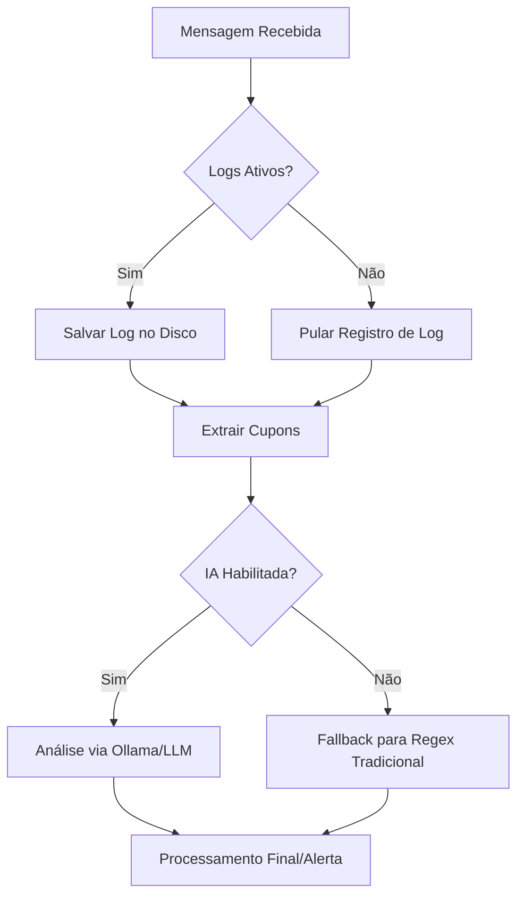
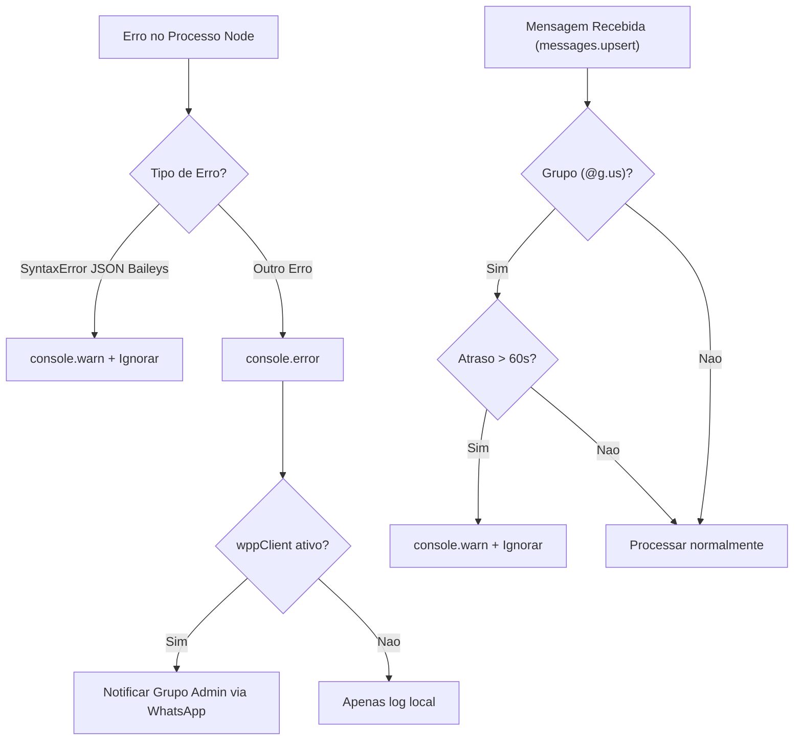

# AI Knowledge Base - G_aBot

## Fluxo de Processamento de Mensagens e Cupons



## Arquivos Modificados/Criados

| Arquivo | Ação | Descrição |
| --- | --- | --- |
| [src/config.js](file:///home/gabs/projects/G_aBot/src/config.js) | Modificado | Adicionada a flag `logsEnabled` nas configurações do bot. Convertida função tradicional `buildOllamaInstances` em arrow function. |
| [src/services/messageLogger.js](file:///home/gabs/projects/G_aBot/src/services/messageLogger.js) | Modificado | Adicionado atalho de retorno antecipado se `BOT_CONFIG.logsEnabled` for falso. Convertidas todas as funções para arrow functions com JSDocs estruturados. |
| [src/services/aiCouponParser.js](file:///home/gabs/projects/G_aBot/src/services/aiCouponParser.js) | Modificado | Definido `enabled` permanentemente como `false` em `AI_CONFIG`. Convertidas funções para arrow functions com JSDocs estruturados. |
| [.env.example](file:///home/gabs/projects/G_aBot/.env.example) | Modificado | Adicionada documentação para a nova variável de ambiente `BOT_LOGS_ENABLED`. |
| [test/loggingAndAiToggle.test.js](file:///home/gabs/projects/G_aBot/test/loggingAndAiToggle.test.js) | Criado | Novos testes unitários validando a desativação da IA por padrão, a flag de configuração de logs, e o comportamento do message logger de não escrever arquivos caso os logs estejam desativados. |

## Lógica de Decisão

```text
REGRAS_DE_NEGOCIO_LOGS_E_IA:
- SE BOT_LOGS_ENABLED for "false" no .env, ENTÃO logsEnabled será definido como false em BOT_CONFIG.
- NO LOGGER (messageLogger.js), SE logsEnabled for false, ENTÃO as funções de gravação retornam imediatamente sem tentar acessar o disco.
- NA IA (aiCouponParser.js), a propriedade enabled é mantida como false para impedir qualquer conexão ao Ollama ou parsing com IA, forçando fallback nativo via Regex em couponExtractor.js.
```

## Comportamento da Feature

- **Coleta de Logs de Mensagem**:
  - Pode ser ativada ou desativada via variável de ambiente `BOT_LOGS_ENABLED` (padrão `true` se omitida).
  - Quando desativada (`BOT_LOGS_ENABLED=false`), as chamadas de logs em grupos ou usuários privados retornam de imediato, evitando criação de arquivos e consumo desnecessário de I/O em disco.
- **Desativação do Processamento de Cupons via IA**:
  - A propriedade `enabled` do parser de IA está travada em `false`.
  - Isso remove totalmente o tempo gasto inicializando o Ollama na inicialização e o delay nas mensagens de cupons (fallback regex é instantâneo).

## Checklist de Aceite

- [x] Variável de ambiente `BOT_LOGS_ENABLED` adicionada ao `src/config.js` e documentada no `.env.example`.
- [x] `logGroupMessage` e `logUserMessage` retornam sem escrever no disco se os logs estiverem desativados.
- [x] O parser de IA (`aiCouponParser.js`) foi desativado por padrão definindo `enabled: false`.
- [x] Todas as funções modificadas ou criadas seguem a especificação de arrow functions (`const fn = () => {}`) e utilizam JSDoc nos métodos públicos.
- [x] Testes unitários foram criados especificamente para cobrir essas duas regras.
- [x] Todos os 41 testes da aplicação passam com sucesso.

---

## Resiliencia e Performance do Baileys (Offline Nodes)

### Fluxo de Tratamento de Erros e Mensagens Offline



### Arquivos Modificados

| Arquivo | Acao | Descricao |
| --- | --- | --- |
| [gabot_ofertas.js](file:///home/gabs/projects/G_aBot/gabot_ofertas.js) | Modificado | Adicionados handlers `uncaughtException` e `unhandledRejection` com filtro para erro de JSON do Baileys. Adicionada funcao `notifyAdminError` que envia erros criticos ao grupo admin via WhatsApp. |
| [src/bot/whatsapp.js](file:///home/gabs/projects/G_aBot/src/bot/whatsapp.js) | Modificado | Adicionado filtro de mensagens antigas (>60s) em grupos no `messages.upsert`. Configurado `makeWASocket` com logger silencioso (pino), bloqueio de history sync, desativacao de init queries e filtro de JIDs broadcast. |

### Logica de Decisao

```text
REGRAS_DE_RESILIENCIA_E_PERFORMANCE:

CRASH_PREVENTION (gabot_ofertas.js):
- SE erro for SyntaxError COM "Unexpected non-whitespace character after JSON",
  ENTAO logar como aviso (warn) e NAO encerrar o processo.
- SE erro for qualquer outro tipo,
  ENTAO logar como erro (error), notificar grupo admin via WhatsApp, e NAO encerrar o processo.
- A notificacao ao admin so eh tentada SE wppClient e BOT_CONFIG.adminGroupId existirem.
- O envio usa .catch() (fire-and-forget) para nunca causar erro recursivo.
- A stack trace eh truncada em 500 caracteres para respeitar limites do WhatsApp.

FILTRO_MENSAGENS_ANTIGAS (whatsapp.js - messages.upsert):
- O handler aceita TANTO type "notify" (tempo real) QUANTO "append" (offline/reconexao).
  IMPORTANTE: mensagens offline chegam como "append", NAO como "notify".
  Filtrar apenas "notify" faz o bot ignorar mensagens de grupos apos reconexao.
- SE chatId terminar com "@g.us" (grupo) E o grupo NAO for o BOT_CONFIG.adminGroupId,
  ENTAO comparar messageTimestamp com timestamp atual.
- SE diferenca > 60 segundos, logar aviso e pular (continue).
- O timestamp do Baileys pode ser number ou Long (protobuf), ambos sao tratados.

OTIMIZACAO_SOCKET (whatsapp.js - makeWASocket):
- logger: pino level "silent" -> elimina output de chaves de sessao e buffers.
- syncFullHistory: false -> impede download de historico do celular.
- fireInitQueries: true (padrao) -> MANTER ATIVO, controla apenas fetchProps/fetchBlocklist/fetchPrivacySettings.
  Desativar nao reduz flood de mensagens e pode causar problemas com metadata.
- shouldSyncHistoryMessage: () => false -> rejeita cada notificacao de history sync.
- shouldIgnoreJid: jid @broadcast -> ignora JIDs de status, evita descriptografia.
- getMessage: async () => undefined -> impede loops em retry de mensagens corrompidas.
```

### Comportamento da Feature

- **Prevencao de Crash (Global)**:
  - O processo Node.js NAO morre em nenhum cenario de `uncaughtException` ou `unhandledRejection`.
  - Erros de JSON malformado do Baileys (offline nodes) sao tratados silenciosamente com `console.warn`.
  - Todos os outros erros criticos sao logados e notificados no grupo admin do WhatsApp com timestamp, mensagem e stack trace.

- **Filtro de Mensagens Antigas**:
  - O handler aceita mensagens de tipo `"notify"` (tempo real) e `"append"` (offline/reconexao).
  - Mensagens de grupo com mais de 60 segundos de atraso sao descartadas antes do processamento.
  - Mensagens privadas e mensagens do **grupo de admin** NAO sao filtradas (sempre processadas independente do timestamp).
  - O filtro atua APOS o Baileys descriptografar, mas ANTES do processamento de comandos/cupons.

- **Otimizacao do Socket Baileys**:
  - Logger interno silenciado — elimina blocos de `<Buffer...>`, `SessionEntry` e chaves criptograficas do PM2.
  - History sync bloqueado em duas camadas: `syncFullHistory: false` e `shouldSyncHistoryMessage: () => false`.
  - `fireInitQueries` mantido como `true` (padrao) — controla apenas metadata inofensiva, NAO o flood de mensagens.
  - JIDs de broadcast ignorados, evitando descriptografar mensagens de status desnecessarias.

### Checklist de Aceite

- [x] Handlers `uncaughtException` e `unhandledRejection` adicionados em `gabot_ofertas.js` com filtro para erro JSON do Baileys.
- [x] Funcao `notifyAdminError` envia erros criticos ao grupo admin com stack trace truncada.
- [x] Handler `messages.upsert` aceita tanto `type: "notify"` quanto `type: "append"` para nao ignorar mensagens offline.
- [x] Filtro de mensagens antigas (>60s) implementado no `messages.upsert` para grupos (grupo admin é isento).
- [x] Logger do Baileys configurado como `silent` via pino.
- [x] `syncFullHistory`, `shouldSyncHistoryMessage`, `shouldIgnoreJid` e `getMessage` configurados no `makeWASocket`.
- [x] `fireInitQueries` mantido como padrao (`true`) — desativa-lo nao ajuda no flood e pode causar regressoes.
- [x] Todos os 41 testes da aplicacao passam com sucesso.
